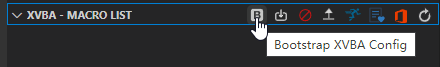
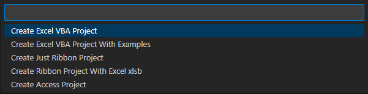
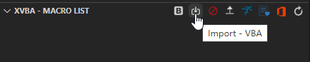
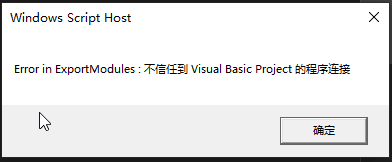
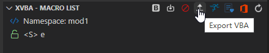
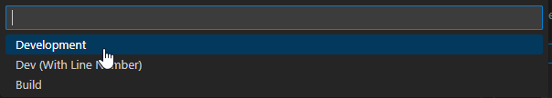
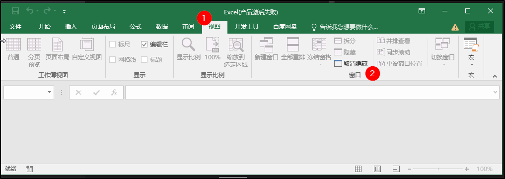
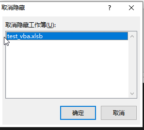
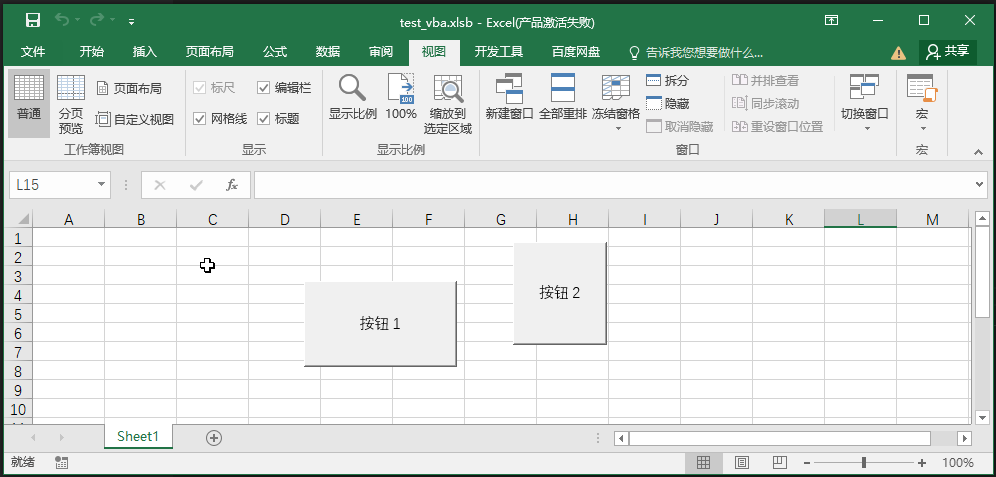

xvba 测试

vscode 安装 xvba: `local-smart.excel-live-server`

左下角 创建 项目 
创建

项目

修改

`config.json`

` "excel_file": "index.xlsb",`

->

` "excel_file": "test_vba.xlsm",`

导入:

错误:

解决方法:

https://blog.csdn.net/JavaSEProgrammer/article/details/125785339

文件---选项---信任中心---信任中心设置---宏设置---勾选启用所有宏---勾选信任对VBA工程对象模型的访问---确定

查看 vba-files 脚本

导出:

开发版?

打开xlsb文件

显示一片空白 参考:
https://blog.csdn.net/bush4/article/details/137072108

第13步

显示了:

