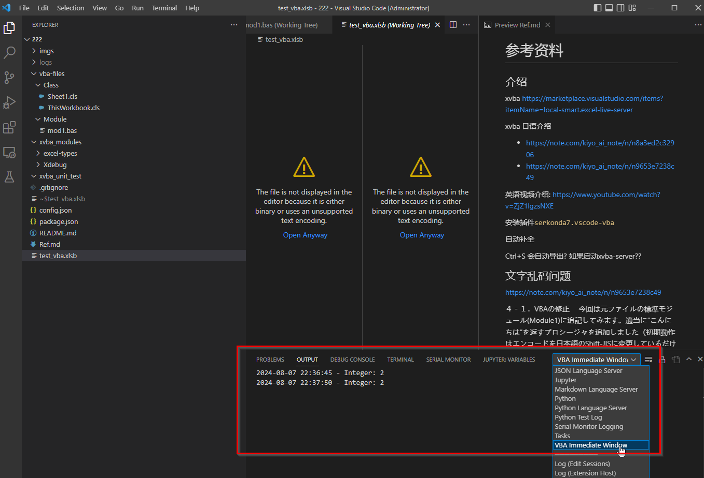

# 参考资料

## 介绍

xvba 
https://marketplace.visualstudio.com/items?itemName=local-smart.excel-live-server

源代码:

https://github.com/aeraphe/excel-autoload

作者github https://github.com/Aeraphe

xvba 日语介绍

* https://note.com/kiyo_ai_note/n/n8a3ed2c32906
* https://note.com/kiyo_ai_note/n/n9653e7238c49 VBA基礎５'：VS CODEでVBAを編集（XVBA）
* https://note.com/shikao29/n/n2eb03cbf92fa XVBA～VSCodeでExcel VBAの開発～
* https://note.com/shikao29/n/n147865190997 XVBA～使用上の注意～

作者YouTube https://www.youtube.com/channel/UCHe803rTgtMpBQ9ezTyN8qA

英语视频介绍: https://www.youtube.com/watch?v=ZjZ1lgzsNXE

安装插件`serkonda7.vscode-vba`

自动补全

Ctrl+S 会自动导出? 如果启动xvba-server??

## 文字乱码问题

https://note.com/kiyo_ai_note/n/n9653e7238c49

４－１．VBAの修正
　今回は元ファイルの標準モジュール(Module1)に追記してみます。適当に”こんにちは”を返すプロシージャを追加しました（初期動作はエンコードを日本語のShift-JISに変更しているだけです）。

中文可以试试 GBK

## 直接运行宏

## 修改sheet 内容

打开Excel, 修改Sheet 内容

保存Excel, 关闭

导出Excel, 保存内容还是存在的.

因此: 
* sheet 内容在Excel文件中保存
* 代码 在 代码文件中保存

## debug print

立即窗口

`Xdebug.printx foo`

## 信任中心

http://club-vba.tokyo/vba-error-sinraisei/#toc5
